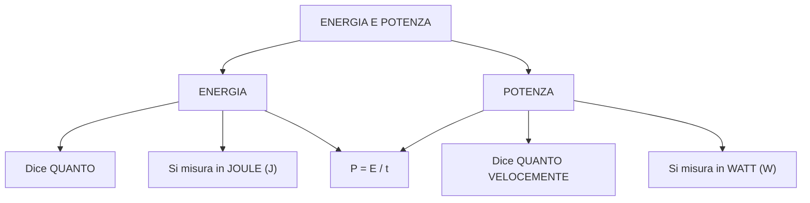
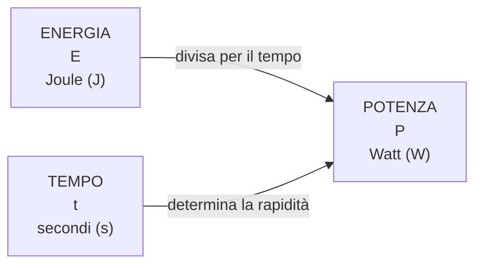

# ⚡ Energia e Potenza

## Slide 1 — Due concetti diversi

**Energia** e **potenza** non sono la stessa cosa.

Possiamo ricordarle così:

> **Energia = QUANTO**  
> **Potenza = QUANTO VELOCEMENTE**

---

## Slide 2 — Che cos'è l'energia?

L'**energia** è la capacità di compiere un lavoro o provocare una trasformazione.

Per esempio, serve energia per:

- accendere una lampadina;
- riscaldare l'acqua;
- far muovere un'automobile;
- far funzionare un computer.

### Unità di misura

L'energia si misura in **joule (J)**.

```text
ENERGIA
   │
   ├── indica QUANTA energia
   │
   └── si misura in JOULE (J)
```

---

## Slide 3 — Che cos'è la potenza?

La **potenza** ci dice **quanto velocemente viene utilizzata o trasferita l'energia**.

### Unità di misura

La potenza si misura in **watt (W)**.

```text
POTENZA
   │
   ├── indica quanto VELOCEMENTE
   │   viene utilizzata l'energia
   │
   └── si misura in WATT (W)
```

---

# Slide 4 — La formula fondamentale

La potenza è:

$$
P = \frac{E}{t}
$$

dove:

- **P** = potenza
- **E** = energia
- **t** = tempo

Quindi:

> **Potenza = Energia ÷ Tempo**

---

## Slide 5 — Che cosa significa 1 watt?

Dalla formula:

$$
P = \frac{E}{t}
$$

possiamo capire che:

$$
1\,W = 1\,J/s
$$

Quindi:

> **1 watt significa utilizzare 1 joule di energia ogni secondo.**

---

## Slide 6 — Un esempio

Due apparecchi utilizzano entrambi:

**1000 J di energia**

### Apparecchio A

Utilizza 1000 J in **10 secondi**:

$$
P = \frac{1000}{10}=100\,W
$$

### Apparecchio B

Utilizza 1000 J in **100 secondi**:

$$
P = \frac{1000}{100}=10\,W
$$

L'apparecchio A è **più potente** perché utilizza la stessa energia in meno tempo.

---

# Slide 7 — Mappa concettuale



---

# Slide 8 — Energia, potenza e tempo

Le tre grandezze sono collegate:



Formula:

$$
\boxed{P=\frac{E}{t}}
$$

Da questa possiamo ricavare anche:

$$
\boxed{E=P\cdot t}
$$

---

# Slide 9 — Il concetto da ricordare

```text
             ENERGIA
                │
                │ QUANTO?
                ▼
          quantità di energia


             POTENZA
                │
                │ QUANTO VELOCEMENTE?
                ▼
        energia utilizzata
          in un certo tempo
```

### La frase da imparare

> **L'energia dice QUANTO.**
>
> **La potenza dice QUANTO VELOCEMENTE.**

E soprattutto:

$$
\boxed{P=\frac{E}{t}}
$$
